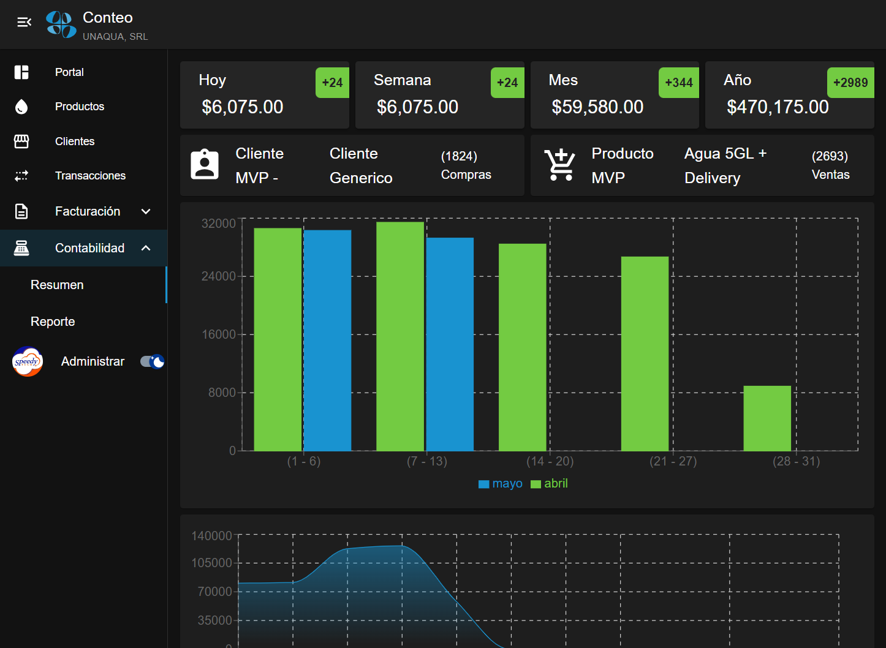
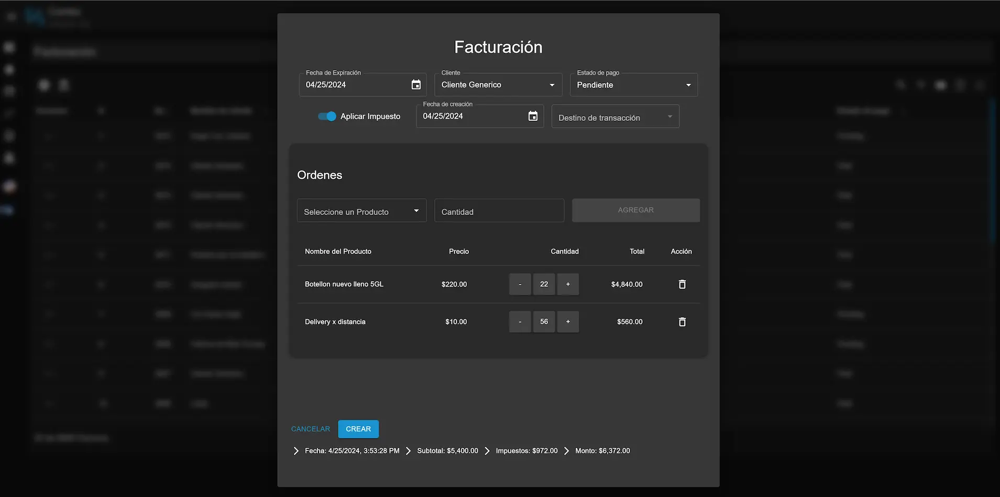
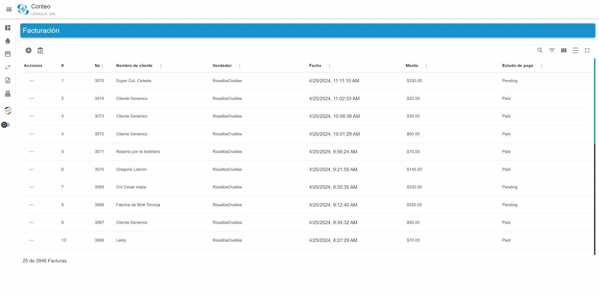

# Conteo Demo Client

This repository is a demo version of the Conteo Client Side application, developed to showcase my front-end development skills, particularly in React, TypeScript, and state management using Overmind.js. The original project is proprietary; this demo provides a simplified version to demonstrate key functionalities and coding practices.

<p align="center">
  
</p>

## Overview

The Conteo Client Demo is a simplified invoicing and billing application. It allows users to manage clients, create and edit invoices, and track payments. This demo focuses on showcasing:

- TypeScript usage in a React project.
- Modular architecture with reusable components.
- State management with Overmind.js.
- Handling asynchronous operations and API requests with the fetch API.
- Responsive design with MaterialUI.

## Demo Features

- **Client Management**: Add, view, and edit client details.
- **Dark and light mode**: Add, view, and edit client details.
- **Progressive Web App**: Use Conteo as a standalone application.
- **Invoice Management**: Create, view, and manage invoices.
- **Payment Tracking**: Record and manage payments against invoices.
- **Invoice Generation**: Record and manage payments against invoices.
- **Responsive UI**: Designed to work well on both desktop and mobile.

## Core Technologies

- **Vite React**: For building
- **Typescript**: for type safety during development
- **Overmind**: For state management
- **MaterialUI**: For styling

## Folder Structure

```perl
conteo.client-demo/
├── public/               # Public assets
├── src/
│   ├── components/       # Reusable UI components
│   ├── pages/            # Page components (e.g., Clients, Invoices)
│   ├── store/            # Overmind state management & configuration
│   ├── api/              # API service definitions
│   ├── hooks/            # Custom Hooks configurations
│   ├── assets/           # Static assets
│   ├── config/           # Application configurations such as theme
│   ├── types/            # Application global types
│   ├── util/             # Functions to help with format
│   ├── Disconnected.tsx/ # Fallback page to be handle by server
│   └── App.tsx           # Main application component
├── README.md             # Project documentation
└── package.json          # Project metadata and dependencies
```

<p align="center">
  
</p>
<p align="center">
  
</p>
<p align="center">
  
</p>
